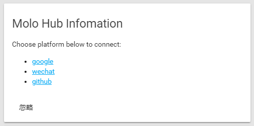
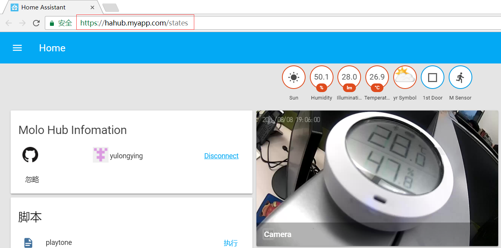
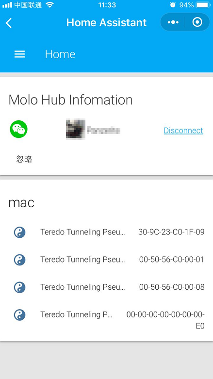

## **【简介】**

这是一个将本地的HA控制网页反向代理到公网, 这样公网就可以轻松访问到HA控制台页面, 并控制家里已经连上HA的硬件. 基于安全方面的考虑, 该组件需要经过Google, GitHub或微信小程序的授权才能正常使用.

**【安装软件】**

- [molohub组件](https://github.com/haoctopus/molohub)
  下载molohub文件夹，保存在`HomeAssistant配置目录/custom_components/`目录中。

**【HA中配置实例】**

```yaml
molohub:
```

**【相关链接】**
平台入口网站：<http://www.molo.cn>
molohub组件：<https://github.com/haoctopus/molohub>

**【效果展现】**

****

****

****
