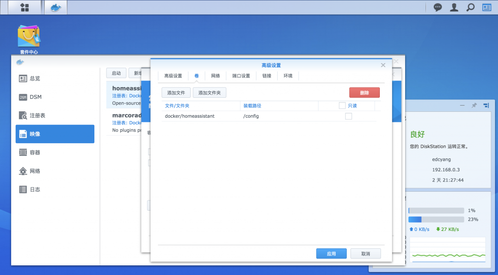

## **【中文简介】**


这是一个将本地的HA控制网页反向代理到公网, 这样公网就可以轻松访问到HA控制台页面, 并控制家里已经连上HA的硬件. 基于安全方面的考虑, 该组件需要经过Google, GitHub或微信小程序的授权才能正常使用.

由于Home Assistant运行于局域网下, 想要通过外网远程访问HA, 首先HA部署环境所在网络下的路由器支持端口映射(port mapping), 映射后在公网通过ip:port直接访问，同时为了方便访问还需要一个ddns服务来把wan ip和动态域名绑定。但是由于网络供应商的网络环境复杂性, 以及用户自身内网环境复杂性, 很难系统性地总结一套通用有效的方法来实现. 上述技术实施起来比较繁琐, 对普通用户来说门槛较高, 本组件旨在简化用户进行远程访问本地HA控制网络.

**【安装软件】**

- [molohub组件](https://github.com/haoctopus/molohub)

下载`molohub`文件夹，保存在`<homeassistant配置目录>/custom_components/`目录中，若`custom_components`目录不存在则自行创建。

- homeassistant配置目录在哪?

**Windows用户:** `%APPDATA%\.homeassistant`

**Linux-based用户:** 可以通过执行`locate .homeassistant/configuration.yaml`命令，查找到的`.homeassistant`文件夹就是配置目录。

**Docker用户:** 进入Docker - 映像 - homeassistant - 高级设置 - 卷, `/config`对应的路径就是配置目录



**【HA中配置实例】**

```yaml
molohub:
```

**【相关链接】**

平台入口网站：<https://www.molo.cn>

molohub组件：<https://github.com/haoctopus/molohub>

**【效果展现】**


****

****

****


****
****

## **【Description in English】**


This is a component forwards the local HA control web page to the public network, so that the public network can be easily accessed, and interact with the hardwares at home that has connected to the HA. For security reasons, this component needs to be authorized by Google, GitHub or Wechat Mini Program to work properly.

when Home Assistant runs under the LAN, if you want to access the HA remotely through the WAN, the router under the network where the HA deployed must supports port mapping , and will be directly accessible on the public network after mapping. also generally ddns is also needed to solve ip change problem. But due to the network provider's The complexity of the network environment, and the complexity of the user's own internet environment, it is difficult to systematically summarize a set of general and effective methods to achieve the target. The above technology is more complicated to implement, and the threshold for ordinary users is higher. This project aims to simplify users to remotely access the local HA control network.

**【Installation】**

- [molohub component](https://github.com/haoctopus/molohub)

Download `molohub` folder and put it under `homeassistant configuration directory/custom_components/`. If `custom_components` doesn't exist, create one.

- Where is homeassistant configuration directory?

**Windows user:** `%APPDATA%\.homeassistant`

**Linux-based user:** Run command line `locate .homeassistant/configuration.yaml`. The `.homeassistant` folder in the returning result is the configuration directory.

**Docker user:** Go to Docker - Images - Homeassistant - Advanced settings - Volumes, the path corresponding to `/config` is the configuration directory.


**【Configuration】**

```yaml
molohub:
```

**【Reference link】**

Platform entrance link：<https://www.molo.cn>

molohub component：<https://github.com/haoctopus/molohub>

**【Demonstration】**


****

****

****

